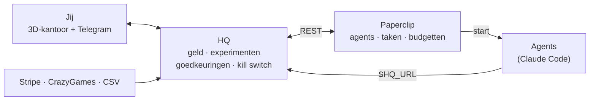

# AI-onderneming

Het besturingssysteem van een holding van AI-agents. Agents zoeken uit waar geld te verdienen valt, doen
kleine experimenten, meten de resultaten en schuiven budget naar wat werkt. Jij bent de eigenaar: je keurt
geld, publicaties en nieuwe agents goed vanaf je telefoon, en je hebt altijd een noodstop.

**Het kantoor.** Je bestuurt alles vanuit een 3D-kantoor in je browser. Elke agent is een poppetje dat echt
werkt: typen aan het bureau als er een taak loopt, naar een collega lopen om iets te bespreken, naar de
kennisbank (met de Graphify-kennisgraaf als hologram) als het iets wil weten, en een papiertje naar jouw bureau
brengen als er iets goedgekeurd moet worden. Klik op een poppetje om het een naam te geven, een ander uiterlijk
te kiezen en te zien waar het mee bezig is. Het projectenbord hangt in de vergaderzaal, alle cijfers staan in de
controlekamer van de HQ-bot, en de rode knop in jouw kantoor is de noodstop. Klik op een agent om hem een taak
te geven. In de **werkplaats** zie je je eigen projecten (online?, tests, uitrol, wat op jou wacht) en zit elke
Claude Code-sessie die eraan werkt als poppetje aan een bureau.

**Agents op het web.** Elke agent zoekt en leest op het web (WebSearch, WebFetch, `hq-web` met een echte browser,
`hq-trends` voor wat er speelt), altijd eerst de kennisbank, en binnen de regels: alleen openbare pagina's,
robots.txt, geen persoonsgegevens. **Gratis AI:** eenvoudige rollen en de kennisgraaf kunnen via een router op de
gratis lagen van Groq, Cerebras en Google draaien, met doorschakelen als er één vol zit.



- **Paperclip** (open source, MIT) regelt de agents: organigram, taken, heartbeats, budget per agent,
  aannames, audit-log en een web-UI.
- **HQ** (deze map) is wat we er zelf omheen bouwden: het grootboek, experimenten met harde budgetten,
  automatische KEEP/ITERATE/KILL-beslissingen, portfolio-verdeling, lessen, de kennisbank, goedkeuringen via
  Telegram, de kill switch en het 3D-kantoor.
- **company/** beschrijft het bedrijf als code: de CEO, de analist, hun spelregels (skills), routines en
  sjablonen waarmee de Agent Factory nieuwe agents en hele takken maakt.

## Hoe een idee geld wordt (of stopt)

1. Verkenners zoeken elk in een eigen bron waarnemingen met links, de tak-lead maakt een top 5, de criticus schiet
   er minstens 3 af met live data. Lopen er al 2 experimenten, dan slaat de raad een week over.
2. De tak-lead dient het beste idee in als experiment: hypothese, één meetpunt met drempel, max. €20 en 14 dagen.
3. **Jij krijgt een Telegram-bericht met ✅/❌.** Pas na ✅ maakt HQ in Paperclip een project met een
   **harde budgetstop** en een taak voor de lead.
4. Agents bouwen en melden metingen; betrouwbare cijfers komen uit imports of van jou (`/meting`).
5. HQ beoordeelt elke ochtend: **KEEP** (doel gehaald → opschaalplan, weer via jou), **ITERATE** (signaal,
   één nieuwe poging) of **KILL** (stoppen). De analist schrijft de lessen op.
6. Elke maandag stelt HQ een nieuwe budgetverdeling voor: startbudget + 30% van de omzet van de laatste
   30 dagen per tak, binnen jouw plafond.

## Wat agents nooit zelf doen
Geld uitgeven, accounts aanmaken, iets publiceren, omzet boeken of een nieuwe agent starten. Voor alles
behalve omzet dienen ze een verzoek in; omzet komt alleen uit imports of van jou.

## Snelstart
Volledige installatie: **[docs/SETUP.md](docs/SETUP.md)** (VPS, Tailscale, Paperclip, Telegram, HQ).

```bash
# ontwikkelen/testen op je eigen computer
cd onderneming/hq
npm install
npm test                  # geen database of Paperclip nodig
npm run build
node dist/main.js help    # alle commando's
```

Dezelfde stappen draaien in CI (`.github/workflows/hq.yml`) bij elke PR en elke push naar `main`.

Het kantoor bekijken zonder server of echte gegevens: start HQ en open `/demo`, of bouw de losse demo-pagina
met `npm run demo` (één HTML-bestand in `dist/demo/kantoor-demo.html`, werkt ook offline).

| Adres | Wat |
|---|---|
| `/` of `/kantoor` | het 3D-kantoor (eenmalig inloggen met `/?token=<HQ_ADMIN_TOKEN>`) |
| `/overzicht` | alles in lijsten: agents, experimenten, grootboek, goedkeuringen |
| `/kennis` | de interactieve kennisgraaf van Graphify |
| `/demo` | het kantoor met een verzonnen bedrijf (geen login nodig, niets echt) |

## Commando's (`node dist/main.js <commando>`)
| Commando | Wat |
|---|---|
| `serve` | API, dashboard, Telegram-bot en planner (draait 24/7 als service) |
| `bootstrap` | `company/` in Paperclip zetten of bijwerken (veilig om vaak te draaien) |
| `branch games games "Games-studio"` | zelf direct een tak opzetten uit een sjabloon |
| `check` | controleert database, Paperclip, Telegram en `company/` |
| `status`, `report` | status of dagrapport in de terminal |
| `halt [reden]`, `resume` | noodstop aan/uit |
| `import-csv bestand.csv` | omzet importeren |
| `kennis` | kennisbank-map bijwerken en (met `GRAPHIFY_API_KEY` of de gratis router) de kennisgraaf opbouwen |
| `werkplaats` | je projecten één keer bij GitHub bijwerken, sites controleren en de stand tonen |
| `gratis-ai [--schrijf\|test]` | gratis AI-router: welke modellen je sleutels geven, config schrijven, proefvraag |

## Telegram
`/status` · `/rapport` · `/goedkeuringen` · `/experimenten` · `/agents` · `/budget` ·
`/omzet 12,50 games` · `/meting EXP-3 plays 740` · **`/stop`** · `/hervat`

## Documentatie
- [docs/SETUP.md](docs/SETUP.md): installatie, stap voor stap
- [docs/ARCHITECTUUR.md](docs/ARCHITECTUUR.md): hoe het in elkaar zit en waarom
- [docs/RUNBOOK.md](docs/RUNBOOK.md): dagelijks gebruik en wat te doen als er iets misgaat
- [docs/KOSTEN.md](docs/KOSTEN.md): wat het kost en hoe de plafonds werken
- [docs/lessen.md](docs/lessen.md): wat we leerden tijdens het bouwen (ook geheugen voor de agents)

## Mappen
```
onderneming/
  hq/          de HQ-service (TypeScript, Node 22+)
    src/       domain/ (geld, experimenten, regels), api/ (REST + pagina's), bot/ (Telegram),
               company/ (bootstrap, Agent Factory), jobs/ (planner), importers/ (Stripe, CSV),
               paperclip/ (client), notify/ (Telegram, WhatsApp), office/ (gebeurtenissen voor het
               kantoor, Paperclip meekijken, run-logboek), knowledge/ (kennisbank, Obsidian-map,
               Graphify, vooronderzoek bij voorstellen), code/ (de werkplaats: GitHub, gezondheid,
               sessies, hooks), ai/ (gratis AI-router)
    web/       het 3D-kantoor (three.js): office/ (code), assets/ (Kenney-poppetjes en -meubels, CC0)
    test/      tests met een in-memory Postgres en een nep-Paperclip
  company/     het bedrijf als code: company.yaml, agents/, skills/, templates/
  deploy/      installatiescript, systemd-services, back-up, update; tools/ (hq, hq-web, hq-trends,
               hq-graaf voor agents), claude-code/ (hook om Claude Code live in het kantoor te zien)
  docs/        handleidingen
```
