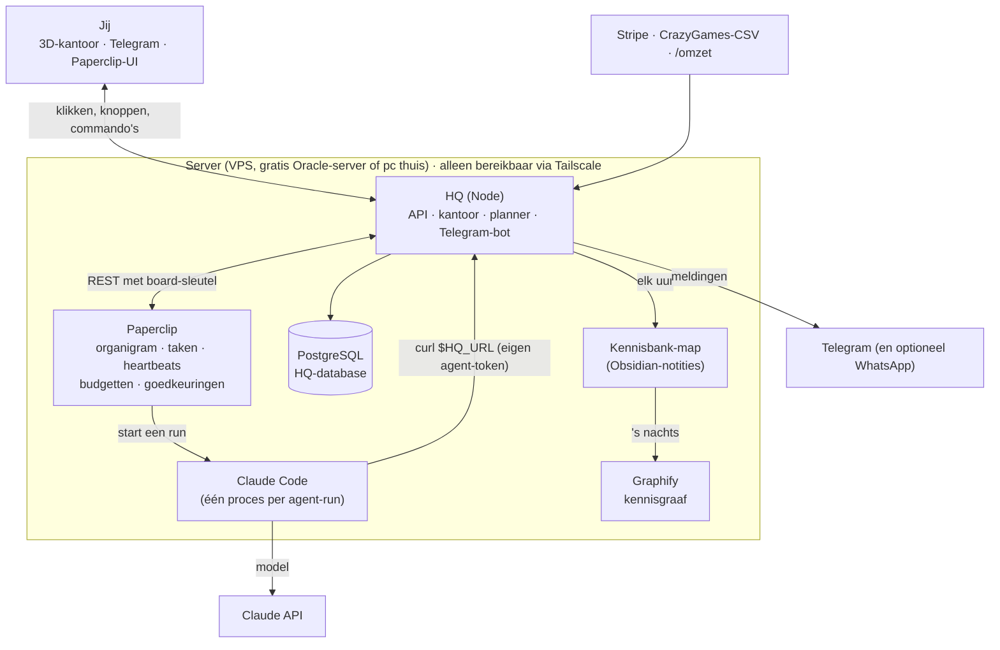
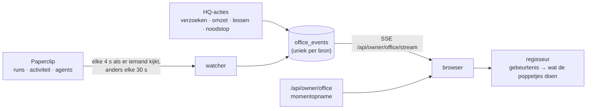
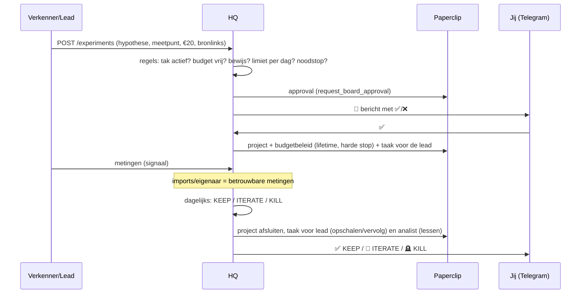

# Architectuur

## In één zin
**Paperclip** regelt de agents; **HQ** regelt geld, experimenten, beslissingen en veiligheid; **jij** stuurt
alles vanuit het **3D-kantoor** en Telegram. Alles draait op één server; niets is open op het internet
(Tailscale + firewall).

## Wie doet wat
| Onderdeel | Verantwoordelijk voor | Niet voor |
|---|---|---|
| **Paperclip** | agents (aannemen, pauzeren, heartbeats), taken, routines op schema, kosten per agent/project, **harde budgetstops**, audit-log, web-UI | geld dat binnenkomt, experimentlogica |
| **HQ** | grootboek (omzet, AI-kosten, uitgaven), experimenten en hun beslissingen, portfolio, lessen, goedkeuringen via Telegram, kill switch, dagrapport | agents zelf draaien |
| **Agents** | onderzoek, voorstellen, bouwen, meten, lessen schrijven | geld, accounts, publiceren, omzet boeken |
| **Jij** | ✅/❌ op geld, publicaties, aannames en nieuwe takken; omzet invoeren als die niet automatisch binnenkomt | het dagelijkse werk |

## Het kantoor
Het kantoor (`/`) is de plek waar je alles bedient. Elk poppetje is een echte agent uit Paperclip; wat je ziet
gebeurt echt. Er wordt niets gesimuleerd behalve wat sfeer als er niets gebeurt (koffie halen, een praatje; met
🐢 zet je dat uit).

| Wat je ziet | Wat er echt gebeurde | Bron |
|---|---|---|
| Iemand zit te typen, met de taak op het scherm | een run in Paperclip loopt | Paperclip `live-runs` + `heartbeat-runs` |
| Iemand loopt naar een collega en praat (ballon) | een reactie op een taak, of een nieuwe taak voor die collega | Paperclip-activiteit (`issue.comment_added`, `issue.created`) |
| Iemand loopt naar de kennisbank, het hologram licht op | de agent vroeg iets aan de kennisbank of schreef iets op | HQ `GET /api/agent/knowledge`, `POST /api/agent/notes`, lessen |
| Iemand brengt een papiertje naar jouw bureau | een verzoek wacht op jouw ✅/❌ | HQ-goedkeuringen |
| Iemand zit op de bank bij de receptie | een sollicitant (nieuwe agent) wacht op jou | Paperclip `agent.hire_created` |
| Muntjes in een afdeling | omzet geboekt | HQ-grootboek |
| Drie of meer van één afdeling in de vergaderzaal | ze werken tegelijk aan iets | afgeleid uit de runs |
| De HQ-bot in de controlekamer stuurt iets | een Telegram-bericht aan jou | HQ-meldingen |
| Rood licht, iedereen terug naar de eigen plek | noodstop | HQ kill switch |

Klikbaar: elk poppetje (naam geven, uiterlijk kiezen, waar het aan werkt, kosten, pauzeren), het projectenbord
(vergaderzaal), de cijfermuur (controlekamer), de kluis (grootboek), het hologram (kennisgraaf), jouw bureau
(verzoeken) en de rode knop (noodstop). `/overzicht` is de oude pagina met alles in lijsten; `/demo` is een
verzonnen bedrijf om het kantoor te laten zien zonder echte gegevens.

**Hoe het werkt.**

- Alles wat het kantoor laat zien is eerst een rij in `office_events`, met een unieke bronsleutel. Zo telt een
  Paperclip-activiteit nooit dubbel, ook niet na een herstart. De browser haalt na een verbroken verbinding op
  wat hij miste (`Last-Event-ID`).
- De plattegrond wordt uitgerekend uit de takken en agents: een tak is een afdeling, een nieuwe agent krijgt
  een bureau, en het gebouw groeit mee. Poppetjes lopen met A* om meubels en muren heen.
- Techniek: three.js (zonder React) in één bestand van ±800 kB, gebouwd met esbuild en geserveerd door HQ zelf.
  Poppetjes en meubels zijn van Kenney (CC0, zie `hq/web/assets/CREDITS.md`). Er draait geen extra server.
- Alleen jij komt erin (dezelfde `HQ_ADMIN_TOKEN` als de eigenaar-API, als cookie). `/demo` toont niets echts.

## Kennisbank en Graphify
Agents maken dezelfde fout niet twee keer als ze eerst kijken wat al bekend is. Daarom:
1. **Eerst vragen:** `GET /api/agent/knowledge?q=...` doorzoekt lessen, notities en de kennisgraaf in één keer
   (skill `hq-api`). Het poppetje loopt dan naar de kennisbank.
2. **Opschrijven:** lessen (na een experiment) en notities (`POST /api/agent/notes`, max 20 per dag per agent).
3. **De map:** HQ schrijft elk uur een Obsidian-map (`HQ_VAULT_DIR`) met takken, experimenten, lessen, notities
   en agents, met `[[links]]`. Je kunt hem zelf openen in Obsidian.
4. **De graaf:** 's nachts bouwt [Graphify](https://github.com/Graphify-Labs/graphify) (Apache-2.0, `pipx install graphifyy`) uit die map een kennisgraaf
   (met Haiku, alleen als `GRAPHIFY_API_KEY` is ingesteld). Zonder sleutel maakt HQ zelf een eenvoudigere graaf uit
   de verbanden (tak, experiment, les, tag, agent). Het hologram in de kennisbank toont de graaf; `/kennis` opent
   de interactieve weergave van Graphify zelf.

## Waarom een eigen kantoor (en niet Claw3D of AI Town)
We keken eerst wat er al bestaat. De keuze: **een eigen, lichte three.js-weergave binnen HQ**, met ideeën van
de anderen. Reden: jouw agents draaien in Paperclip en het geld zit in HQ; een kantoor dat daar direct op aansluit
is één server, één login en geen tweede systeem om bij te houden. Wat je ziet komt uit echte gebeurtenissen,
niet uit een simulatie.

| Project | Wat het is | Waarom niet als basis | Wat we overnamen |
|---|---|---|---|
| Claw3D (MIT) | mooi 3D-kantoor voor agents | een aparte Next.js/React Three Fiber-app, gebouwd rond de OpenClaw-gateway; wij zouden een tweede server en een koppeling naar Paperclip moeten onderhouden | kamers met live status, klikbare poppetjes, het kantoor als bedieningspaneel |
| AI Town (MIT) | stadje met LLM-personages | een simulatie (personages bedenken zelf wat ze doen) die Convex als backend nodig heeft | lopen en praten met tekstballonnen |
| Generative Agents (Stanford) | onderzoekscode in Python | niet bedoeld om te draaien als product; de kaart en sprites hebben geen duidelijke vrije licentie | het idee van geheugen en reflectie (onze kennisbank) |
| Axial Studio / Agentic OS | agent-kantoor | niet open source | projectenbord aan de muur, kluis, whiteboard per afdeling |
| The Delegation / Agent Office (Valeri Does AI) | demo's en video's | geen code om op te bouwen | logboek, projectinformatie in de ruimte, organigram |
| Pixel Agents (MIT) | pixel-art kantoor in VS Code | koppelt aan Claude Code-terminals in VS Code, niet aan Paperclip | bevestiging dat "agents als poppetjes" prettig werkt |

## Levensloop van een experiment

**Beslisregels** (`hq/src/domain/evaluator.ts`, getest):
- **KEEP** zodra een *betrouwbare* meting het doel haalt (mag voor de deadline).
- Loopt nog zolang deadline en budget niet op zijn.
- Daarna **ITERATE** bij signaal (betrouwbaar ≥ 50% van het doel, of een agent-meting ≥ doel) en nog iteraties
  over (max. 2), anders **KILL**.
- Stoppen gebeurt automatisch (bespaart alleen geld). Opschalen vraagt altijd jouw akkoord.

## Goedkeuringen
Alles wat op jou wacht, is een approval in Paperclip. HQ spiegelt ze, zet ze met knoppen in Telegram en voert
het besluit uit. Beslis je in de Paperclip-UI, dan neemt HQ dat binnen twee minuten over.

| Soort | Komt van | Na ✅ |
|---|---|---|
| `experiment_start` | agent via HQ | project met budgetstop + taak voor de lead |
| `budget_increase` | lead na een KEEP | hoger projectbudget, gepauzeerd project hervat |
| `spend` | agent via HQ | geboekt als uitgave; **jij** betaalt, agents kunnen dat niet |
| `branch_create` | CEO via HQ | Agent Factory bouwt de tak (agents, routines, budget) |
| `portfolio` | HQ, elke maandag | nieuwe budgetten per tak + maandplafond in Paperclip |
| `hire_agent` | CEO/lead in Paperclip | Paperclip activeert de agent |
| `ceo_strategy` | CEO in Paperclip | weekplan akkoord |
| `budget_override` | Paperclip bij een budgetstop | ✅ = budget +50% en hervatten, ⏸ = gepauzeerd laten |

## Vier lagen geldbeveiliging
1. **Anthropic Console-limiet** (buiten het systeem): de API-sleutel stopt bij je maandlimiet.
2. **Paperclip, harde stops:** maandplafond voor het hele bedrijf, maandbudget per agent en een levenslang budget
   per experimentproject. Bij overschrijding pauzeert Paperclip het werk zelf.
3. **HQ, poorten vooraf:** max. €50 per experiment, takbudget, totaal plafond (+30% van de omzet), max. 5 verzoeken
   per agent per dag, bewijslinks verplicht.
4. **HQ, noodstop:** `/stop` of automatisch als de AI-kosten van vandaag boven `HQ_DAILY_SPEND_ALARM_EUR` komen.
   Het bedrijf in Paperclip en alle agents gaan op pauze, lopende runs worden afgebroken, en de HQ-API weigert
   agent-acties met `423`.

## Veiligheid
- **Geen open poorten:** de firewall laat alleen SSH en Tailscale toe. Telegram werkt met *long polling* (HQ haalt
  berichten op), dus er is geen webhook nodig.
- **Agents bewijzen wie ze zijn** met hun eigen Paperclip-token; HQ vraagt Paperclip wie erachter zit
  (`/api/agents/me`). Agents van een ander bedrijf of beëindigde agents komen er niet in.
- **Agents kunnen geen omzet boeken:** daar is geen endpoint voor, en de database weigert bron `agent`.
- **Agent-metingen tellen niet als bewijs** (`trusted=false`); alleen imports en jij leveren bewijs.
- **Wat HQ zelf mag zonder jou:** experimenten stoppen, alles pauzeren, en de aannames goedkeuren die horen bij een
  tak die jij net goedkeurde. Verder niets dat geld kost.
- **Geheimen** staan alleen in `~/.config/hq/hq.env` (chmod 600). De board-sleutel is krachtig: deel hem nooit.
- **Prompt-injectie** (een agent leest een kwaadaardige webpagina): HQ's harde regels gelden hoe overtuigend een
  agent ook schrijft: bedragen, limieten, bewijs, rate limits en jouw ✅.

## Datamodel (HQ)
| Tabel | Inhoud |
|---|---|
| `branches` | takken met status, maandbudget en lead-agent (`holding` = overhead) |
| `experiments` | hypothese, meetpunt + doel, budget, deadline, status, voorspelling, Paperclip-project |
| `metrics` | metingen per experiment, met bron en `trusted` |
| `ledger` | alle geldstromen: `revenue`, `token_cost`, `spend`, uniek per bron + extern id (geen dubbeltellingen) |
| `lessons` | lessen met bewijs en tags (full-text doorzoekbaar) |
| `approvals` | spiegel van Paperclip-approvals met soort, bedrag, status en of het besluit is uitgevoerd |
| `settings`, `audit_log`, `job_runs`, `notifications_sent` | noodstop-status, logboek van elke actie, planner-status, meldingen zonder dubbelingen |
| `office_events` | alles wat het kantoor laat zien, uniek per bron (30 dagen bewaard) |
| `notes` | notities van agents voor de kennisbank (full-text doorzoekbaar) |
| `agent_profiles` | bijnaam en poppetje die jij een agent (of jezelf, of de HQ-bot) gaf |

## Uitbreiden
- **Nieuwe tak-soort:** een YAML in `company/templates/branches/` (agents + routines). Daarna `hq bootstrap`.
- **Betere prompts:** pas `company/agents/*.md`, `company/templates/agents/*.md` of `company/skills/*.md` aan.
  `update.sh` zet ze door; alleen agents waarvan het sjabloon echt veranderde worden bijgewerkt.
- **Nieuwe omzetbron:** een importer in `hq/src/importers/` en een job in `hq/src/jobs/scheduler.ts`.
  Voeg de bron toe aan `REVENUE_SOURCES` in `hq/src/domain/ledger.ts`.
- **Andere beslisregels:** `decide()` in `hq/src/domain/evaluator.ts` (pure functie, met tests).
- **Iets nieuws in het kantoor:** een gebeurtenissoort in `hq/src/office/types.ts`, uitzenden met
  `ctx.events.emit(...)`, en in `hq/web/office/director.ts` bepalen wat de poppetjes dan doen. Meubels en kamers
  staan in `hq/web/office/layout.ts` (getallen, met tests) en `world.ts` (3D).
