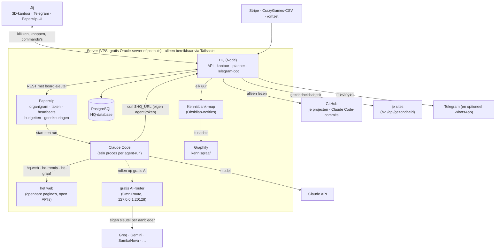
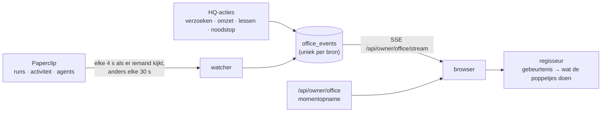
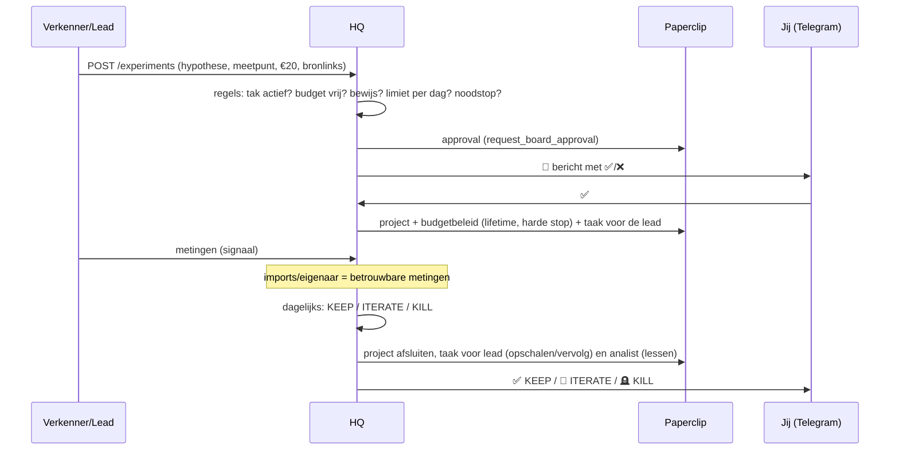

# Architectuur

## In één zin
**Paperclip** regelt de agents; **HQ** regelt geld, experimenten, beslissingen en veiligheid; **jij** stuurt
alles vanuit het **3D-kantoor** en Telegram. Alles draait op één server; niets is open op het internet
(Tailscale + firewall).

## Wie doet wat
| Onderdeel | Verantwoordelijk voor | Niet voor |
|---|---|---|
| **Paperclip** | agents (aannemen, pauzeren, heartbeats), taken, routines op schema, kosten per agent/project, **harde budgetstops**, audit-log, web-UI | geld dat binnenkomt, experimentlogica |
| **HQ** | grootboek (omzet, AI-kosten, uitgaven), experimenten en hun beslissingen, portfolio, lessen, goedkeuringen via Telegram, kill switch, dagrapport | agents zelf draaien |
| **Agents** | onderzoek, voorstellen, bouwen, meten, lessen schrijven | geld, accounts, publiceren, omzet boeken |
| **Jij** | ✅/❌ op geld, publicaties, aannames en nieuwe takken; omzet invoeren als die niet automatisch binnenkomt | het dagelijkse werk |

## Het kantoor
Het kantoor (`/`) is de plek waar je alles bedient. Elk poppetje met een naam is een echte agent uit Paperclip; wat
je ziet gebeurt echt. Er wordt niets gesimuleerd behalve wat sfeer als er niets gebeurt (koffie halen, een praatje,
figuranten zonder naam; met 🐢 zet je dat uit). Niemand zegt iets wat niet gezegd is: krijgt een agent een taak of
een reactie, dan toont hij alleen 📥 (ontvangen) of 👀 (gelezen), geen verzonnen antwoord.

| Wat je ziet | Wat er echt gebeurde | Bron |
|---|---|---|
| Iemand zit te typen, met de taak op het scherm | een run in Paperclip loopt | Paperclip `live-runs` + `heartbeat-runs` |
| Iemand loopt naar een collega en praat (ballon) | een reactie op een taak, of een nieuwe taak voor die collega | Paperclip-activiteit (`issue.comment_added`, `issue.created`) |
| Iemand loopt naar de kennisbank, het hologram licht op | de agent vroeg iets aan de kennisbank of schreef iets op | HQ `GET /api/agent/knowledge`, `POST /api/agent/notes`, lessen |
| Iemand brengt een papiertje naar jouw bureau | een verzoek wacht op jouw ✅/❌ | HQ-goedkeuringen |
| Iemand zit op de bank bij de receptie | een sollicitant (nieuwe agent) wacht op jou | Paperclip `agent.hire_created` |
| Muntjes in een afdeling | omzet geboekt | HQ-grootboek |
| Twee of meer samen aan de vergadertafel ("🤝 Samen aan: …") | ze werken op hetzelfde moment aan dezelfde klus: dezelfde taak, of subtaken van één taak (zoals de ideeënraad) | Paperclip-runs + de bovenliggende taak (`parentId`) |
| ☑️ boven een agent | hij rondde een opdracht af die iemand anders hem gaf | Paperclip-activiteit (`issue.updated` naar klaar) |
| De HQ-bot in de controlekamer stuurt iets | een Telegram-bericht aan jou | HQ-meldingen |
| Rood licht, iedereen terug naar de eigen plek | noodstop | HQ kill switch |
| Ballon "🔎 zoekt: …" of "🌐 leest: …" boven een agent | de agent gebruikt het web of de kennisgraaf tijdens zijn run | het run-logboek in Paperclip (`heartbeat-runs/:id/log`) |
| Een Claude-poppetje in de werkplaats typt of zegt "✍️ …" | een Claude Code-sessie werkt aan een van je projecten, of committe iets | GitHub (commits met `Claude-Session`, branches `claude/…`), of live via een hook |
| Het bord van een project wordt rood, de HQ-bot rent erheen | de site ligt eruit (twee gezondheidschecks op rij mis) | HQ-gezondheidscheck |
| Confetti bij een projectbord | een pull request is samengevoegd of een nieuwe versie staat live | GitHub (pull requests, deployments) |

Klikbaar, en overal kun je ook iets dóén:
- **een poppetje:** waar het aan werkt, kosten, nut, een taak geven, pauzeren of hervatten, naam en uiterlijk;
- **een project** (projectenbord in de vergaderzaal): 📏 een meting invoeren, 💶 omzet boeken, ⚖️ zelf beslissen
  (KEEP, ITERATE of KILL, via hetzelfde pad als de automatische beoordeling);
- **de kluis:** 💶 omzet boeken, 📄 een CSV importeren, de laatste boekingen;
- **het hologram (kennisbank):** zoeken in lessen en notities, met de graaf eronder;
- **de cijfermuur:** cijfers, en de nut-meter (💤 nu al pauzeren wie niets oplevert);
- **jouw bureau:** verzoeken goedkeuren of afwijzen; **de rode knop:** noodstop;
- **de werkplaats:** projecten volgen, Claude Code een opdracht geven. `/overzicht` is de oude pagina met alles in lijsten; `/demo` is een
verzonnen bedrijf om het kantoor te laten zien zonder echte gegevens.

**Hoe het werkt.**

- Alles wat het kantoor laat zien is eerst een rij in `office_events`, met een unieke bronsleutel. Zo telt een
  Paperclip-activiteit nooit dubbel, ook niet na een herstart. De browser haalt na een verbroken verbinding op
  wat hij miste (`Last-Event-ID`).
- De plattegrond wordt uitgerekend uit de takken en agents: een tak is een afdeling, een nieuwe agent krijgt
  een bureau, en het gebouw groeit mee. Poppetjes lopen met A* om meubels en muren heen.
- Techniek: three.js (zonder React) in één bestand van ±800 kB, gebouwd met esbuild en geserveerd door HQ zelf.
  Poppetjes en meubels zijn van Kenney (CC0, zie `hq/web/assets/CREDITS.md`). Er draait geen extra server.
- Alleen jij komt erin (dezelfde `HQ_ADMIN_TOKEN` als de eigenaar-API, als cookie). `/demo` toont niets echts.

## De werkplaats (je projecten en Claude Code)
Naast de holding bouw je zelf aan projecten met Claude Code (bijvoorbeeld een scanner-SaaS of een game). HQ volgt
die in de werkplaats, zonder er iets aan te veranderen:
- **GitHub, alleen lezen** (`HQ_GITHUB_TOKEN`), om de twee minuten, met ETags (een ongewijzigde pagina kost geen
  limiet): de hoofdbranch, branches van Claude Code (`claude/…`) en van open pull requests, hun commits, pull
  requests, tests (Actions en commit-statussen, zoals Vercel), de laatste uitrol naar productie (deployments) en
  `BACKLOG.md`. Eén keer per uur kijkt HQ of het token nieuwe repositories heeft en volgt die vanzelf
  (`src/code/follow.ts`): site uit het veld *Website*, gezondheidscheck als er een echte is. Wat je weghaalde of wat
  gearchiveerd is, blijft weg (`HQ_AUTO_FOLLOW=uit` zet het uit).
- **Claude Code-sessies** zijn te herkennen aan `Claude-Session: https://claude.ai/code/session_…` onder de commits
  (Claude Code in de cloud zet die er zelf onder) en aan de eigen branch. Eén branch = één sessie. Optioneel meldt
  een hook (`deploy/claude-code/hq-hook.mjs`) elke stap live aan `POST /api/hooks/claude-code`, met een eigen geheim
  dat alleen kan schrijven.
- **Helpers (sub-agents):** zet een sessie een helper in (tool `Agent`, hooks `SubagentStart`/`SubagentStop`), dan
  krijgt die een eigen poppetje naast de sessie (`code_helpers`), met zijn opdracht en zijn stappen. De installer
  zet twee helpers klaar voor je eigen Claude Code: `onderzoeker` (alleen lezen op het web) en `reviewer` (frisse
  blik op de wijzigingen). Waarom juist deze twee: [ONDERZOEK-AGENTS.md](ONDERZOEK-AGENTS.md).
- **Gezondheidscheck** per site (om de vijf minuten): twee keer mis = storing, met bericht; de uptime van de
  laatste 24 uur staat op het bord.
- **Jouw beurt:** punten in de backlog onder een kopje dat zegt dat ze bij jou liggen, komen bovenaan in het
  projectpaneel en tellen mee in de chip in de bovenbalk. Zo zie je in één oogopslag wat er tussen je project en
  de eerste omzet staat, en wat alleen jij kunt doen (KvK, domein, accounts, betalen).

## Agents op het web
Elke agent heeft de zoek- en leestools van Claude Code (WebSearch, WebFetch; Paperclip start runs zonder
toestemmingsvragen), plus drie commando's die setup-vps.sh in `/usr/local/bin` zet: `hq-web` (Crawl4AI, een echte
browser; weigert interne adressen en respecteert robots.txt zelf), `hq-trends` (last30days, alleen bronnen met een
open API) en `hq-graaf` (Graphify). De skills `onderzoek` en `kennisgraaf` beschrijven de volgorde (eerst de
kennisbank, dan het web, dan opschrijven) en de regels. HQ leest in het run-logboek van Paperclip mee welke tools
een agent gebruikt en laat dat in het kantoor zien; je hoeft daar niets voor te installeren.

Bij elk experimentvoorstel zoekt HQ zelf in de kennisbank naar vergelijkbare experimenten en lessen (de HQ-bot
loopt naar de kennisruimte). Dat staat bij het voorstel dat jij goedkeurt, en de agent krijgt het terug met advies:
een eerder afgeschoten idee komt zo niet ongemerkt terug.

## Gratis AI
[OmniRoute](https://github.com/diegosouzapw/OmniRoute) (MIT) draait op de server en zet de gratis lagen van zes
aanbieders achter één model: de combo "gratis", met ±15 modellen in een vaste volgorde. Geeft er één een limietfout
(429), dan neemt de volgende het over. `dist/main.js gratis-ai --schrijf` beheert OmniRoute via zijn API: het zet je
sleutels erin, vraagt welke modellen er nu zijn, kiest de beste en maakt een eigen sleutel voor HQ (die geen
prompts bewaart en niets aan de tekst verandert). Rollen uit `HQ_GRATIS_AI_ROLES` draaien Claude Code via
OmniRoute (Anthropic-formaat, met een kleiner contextvenster), en Graphify kan er de kennisgraaf mee bouwen.
Wat we bewust niet doen, al kan OmniRoute het: abonnementen koppelen, webchat-cookies gebruiken of accounts
stapelen om limieten te ontlopen. Dat schendt de voorwaarden van die aanbieders, en dan ben jij als eigenaar
aansprakelijk. Zulke verbindingen komen nooit in de combo, ook niet als iemand ze in het dashboard toevoegt.

## Kennisbank en Graphify
Agents maken dezelfde fout niet twee keer als ze eerst kijken wat al bekend is. Daarom:
1. **Eerst vragen:** `hq kennis "…"` (= `GET /api/agent/knowledge?q=...`) doorzoekt lessen, notities en de
   kennisgraaf in één keer (skills `hq-api` en `kennisgraaf`). Het poppetje loopt dan naar de kennisbank.
   Graaf-uitvoer komt er pas bij vanaf `HQ_GRAPHIFY_MIN_NOTES` (100) lessen en notities: daaronder vindt gewoon
   zoeken hetzelfde en kost de graaf alleen tokens.
   Verbanden zoeken kan ook direct in de graaf: `hq-graaf uitleg|pad|vraag`. Bouwers gebruiken Graphify op hun
   eigen code (`graphify update .`, zonder AI).
2. **Opschrijven:** lessen (na een experiment) en notities (`POST /api/agent/notes`, max 20 per dag per agent).
3. **De map:** HQ schrijft elk uur een Obsidian-map (`HQ_VAULT_DIR`) met takken, experimenten, lessen, notities
   en agents, met `[[links]]`. Je kunt hem zelf openen in Obsidian.
4. **De graaf:** 's nachts bouwt [Graphify](https://github.com/Graphify-Labs/graphify) (Apache-2.0, `pipx install graphifyy`) uit die map een kennisgraaf
   (met Haiku als `GRAPHIFY_API_KEY` is ingesteld, of gratis via de router met `GRAPHIFY_BACKEND=gratis`), maar pas
   vanaf 100 lessen en notities. Zonder sleutel, of daaronder, maakt HQ zelf een eenvoudigere graaf uit
   de verbanden (tak, experiment, les, tag, agent). Het hologram in de kennisbank toont de graaf; `/kennis` opent
   de interactieve weergave van Graphify zelf.

## De nut-meter
Per agent zet HQ de AI-kosten van de laatste 30 dagen (Paperclip) naast wat hij aantoonbaar opleverde: lessen,
notities, voorstellen, metingen, verzoeken aan jou, taken voor collega's en afgeronde opdrachten
(`src/office/value.ts`, alleen tellen in de database). Een afgeronde opdracht telt alleen als iemand anders hem gaf
(jij, een lead of de CEO): een routine of een taak die een agent zichzelf gaf, bewijst niets. Meer dan €1 uitgegeven
zonder iets terug te vinden = "voor de sier?". Je ziet het in de controlekamer (📊), bij elk poppetje, en elke
maandag in het dagrapport. De controle waar het uit voortkwam, met het onderzoek en de keuzes per rol, staat in
[ONDERZOEK-AGENTS.md](ONDERZOEK-AGENTS.md).

**Wat niets oplevert, kost ook niets meer.** Elke maandag om 7:00 (job `nut-meter`, `HQ_VALUE_CRON`) pauzeert HQ
de agents die "voor de sier?" staan. Uitzonderingen: agents jonger dan 14 dagen, agents die jij in de laatste 14
dagen weer aanzette, en een noodstop. En nooit meer dan de helft van het team tegelijk: dan klopt eerder de meting
niet (HQ meldt dat en pauzeert niemand). Je krijgt een bericht; met ▶️ Hervatten bij het poppetje zet je hem terug.
Uitzetten: `HQ_AUTO_PAUSE=uit`, dan meldt het dagrapport alleen wie geld kost zonder resultaat.

**Naam = doet echt iets.** In het kantoor heeft alleen wie echt werkt een naamkaartje. Een gepauzeerde agent
toont alleen 💤 (klik erop voor zijn naam en ▶️ Hervatten). Daarnaast zitten er figuranten: poppetjes zonder naam
die in de browser koffie halen en uit het raam kijken, maar niets doen en niets kosten. De knop 🐢 🙂 🎉 bepaalt
hoeveel (0, 2 of 4 per afdeling).

## Waarom een eigen kantoor (en niet Claw3D of AI Town)
We keken eerst wat er al bestaat. De keuze: **een eigen, lichte three.js-weergave binnen HQ**, met ideeën van
de anderen. Reden: jouw agents draaien in Paperclip en het geld zit in HQ; een kantoor dat daar direct op aansluit
is één server, één login en geen tweede systeem om bij te houden. Wat je ziet komt uit echte gebeurtenissen,
niet uit een simulatie.

| Project | Wat het is | Waarom niet als basis | Wat we overnamen |
|---|---|---|---|
| Claw3D (MIT) | mooi 3D-kantoor voor agents | een aparte Next.js/React Three Fiber-app, gebouwd rond de OpenClaw-gateway; wij zouden een tweede server en een koppeling naar Paperclip moeten onderhouden | kamers met live status, klikbare poppetjes, het kantoor als bedieningspaneel |
| AI Town (MIT) | stadje met LLM-personages | een simulatie (personages bedenken zelf wat ze doen) die Convex als backend nodig heeft | lopen en praten met tekstballonnen |
| Generative Agents (Stanford) | onderzoekscode in Python | niet bedoeld om te draaien als product; de kaart en sprites hebben geen duidelijke vrije licentie | het idee van geheugen en reflectie (onze kennisbank) |
| Axial Studio / Agentic OS | agent-kantoor | niet open source | projectenbord aan de muur, kluis, whiteboard per afdeling |
| The Delegation / Agent Office (Valeri Does AI) | demo's en video's | geen code om op te bouwen | logboek, projectinformatie in de ruimte, organigram |
| Pixel Agents (MIT) | pixel-art kantoor in VS Code | koppelt aan Claude Code-terminals in VS Code, niet aan Paperclip | bevestiging dat "agents als poppetjes" prettig werkt |

## Levensloop van een experiment

**Beslisregels** (`hq/src/domain/evaluator.ts`, getest):
- **KEEP** zodra een *betrouwbare* meting het doel haalt (mag voor de deadline).
- Loopt nog zolang deadline en budget niet op zijn.
- Daarna **ITERATE** bij signaal (betrouwbaar ≥ 50% van het doel, of een agent-meting ≥ doel) en nog iteraties
  over (max. 2), anders **KILL**.
- Stoppen gebeurt automatisch (bespaart alleen geld). Opschalen vraagt altijd jouw akkoord.

## Goedkeuringen
Alles wat op jou wacht, is een approval in Paperclip. HQ spiegelt ze, zet ze met knoppen in Telegram en voert
het besluit uit. Beslis je in de Paperclip-UI, dan neemt HQ dat binnen twee minuten over.

| Soort | Komt van | Na ✅ |
|---|---|---|
| `experiment_start` | agent via HQ | project met budgetstop + taak voor de lead |
| `budget_increase` | lead na een KEEP | hoger projectbudget, gepauzeerd project hervat |
| `spend` | agent via HQ | geboekt als uitgave; **jij** betaalt, agents kunnen dat niet |
| `branch_create` | CEO via HQ | Agent Factory bouwt de tak (agents, routines, budget) |
| `portfolio` | HQ, elke maandag | nieuwe budgetten per tak + maandplafond in Paperclip |
| `hire_agent` | CEO/lead via HQ (`/hire`) | Paperclip activeert de agent. HQ weigert vooraf als de tak die rol al vol heeft (`maxPerBranch` in het sjabloon) of als een collega met dezelfde rol stilstaat, en zet bovenaan het verzoek de bezetting en de kosten van de tak. Kwam de aanname buiten HQ om binnen, dan staat dat erbij |
| `ceo_strategy` | CEO in Paperclip | weekplan akkoord |
| `budget_override` | Paperclip bij een budgetstop | ✅ = budget +50% en hervatten, ⏸ = gepauzeerd laten |

## Vier lagen geldbeveiliging
1. **Anthropic Console-limiet** (buiten het systeem): de API-sleutel stopt bij je maandlimiet.
2. **Paperclip, harde stops:** maandplafond voor het hele bedrijf, maandbudget per agent en een levenslang budget
   per experimentproject. Bij overschrijding pauzeert Paperclip het werk zelf.
3. **HQ, poorten vooraf:** max. €50 per experiment, takbudget, totaal plafond (+30% van de omzet), max. 5 verzoeken
   per agent per dag, bewijslinks verplicht.
4. **HQ, noodstop:** `/stop` of automatisch als de AI-kosten van vandaag boven `HQ_DAILY_SPEND_ALARM_EUR` komen.
   Het bedrijf in Paperclip en alle agents gaan op pauze, lopende runs worden afgebroken, en de HQ-API weigert
   agent-acties met `423`.

## Veiligheid
- **Geen open poorten:** de firewall laat alleen SSH en Tailscale toe. Telegram werkt met *long polling* (HQ haalt
  berichten op), dus er is geen webhook nodig.
- **Agents bewijzen wie ze zijn** met hun eigen Paperclip-token; HQ vraagt Paperclip wie erachter zit
  (`/api/agents/me`). Agents van een ander bedrijf of beëindigde agents komen er niet in.
- **Agents kunnen geen omzet boeken:** daar is geen endpoint voor, en de database weigert bron `agent`.
- **Agent-metingen tellen niet als bewijs** (`trusted=false`); alleen imports en jij leveren bewijs.
- **Wat HQ zelf mag zonder jou:** experimenten stoppen, alles pauzeren, en de aannames goedkeuren die horen bij een
  tak die jij net goedkeurde. Verder niets dat geld kost.
- **Geheimen** staan alleen in `~/.config/hq/hq.env` (chmod 600). De board-sleutel is krachtig: deel hem nooit.
- **Prompt-injectie** (een agent leest een kwaadaardige webpagina): HQ's harde regels gelden hoe overtuigend een
  agent ook schrijft: bedragen, limieten, bewijs, rate limits en jouw ✅.

## Datamodel (HQ)
| Tabel | Inhoud |
|---|---|
| `branches` | takken met status, maandbudget en lead-agent (`holding` = overhead) |
| `experiments` | hypothese, meetpunt + doel, budget, deadline, status, voorspelling, Paperclip-project |
| `metrics` | metingen per experiment, met bron en `trusted` |
| `ledger` | alle geldstromen: `revenue`, `token_cost`, `spend`, uniek per bron + extern id (geen dubbeltellingen) |
| `lessons` | lessen met bewijs en tags (full-text doorzoekbaar) |
| `approvals` | spiegel van Paperclip-approvals met soort, bedrag, status en of het besluit is uitgevoerd |
| `settings`, `audit_log`, `job_runs`, `notifications_sent` | noodstop-status, logboek van elke actie, planner-status, meldingen zonder dubbelingen |
| `office_events` | alles wat het kantoor laat zien, uniek per bron (30 dagen bewaard) |
| `notes` | notities van agents voor de kennisbank (full-text doorzoekbaar) |
| `agent_profiles` | bijnaam en poppetje die jij een agent (of jezelf, of de HQ-bot) gaf |
| `code_projects` | projecten in de werkplaats: repository, site, gezondheidscheck, en wat HQ de vorige keer zag |
| `code_sessions` | Claude Code-sessies per project (via commits of hooks): opdracht, laatste stap, pull request |
| `code_health` | elke gezondheidscheck (14 dagen bewaard), voor de uptime |

## Uitbreiden
- **Nieuwe tak-soort:** een YAML in `company/templates/branches/` (agents + routines). Daarna `hq bootstrap`.
- **Betere prompts:** pas `company/agents/*.md`, `company/templates/agents/*.md` of `company/skills/*.md` aan.
  `update.sh` zet ze door; alleen agents waarvan het sjabloon echt veranderde worden bijgewerkt.
- **Nieuwe omzetbron:** een importer in `hq/src/importers/` en een job in `hq/src/jobs/scheduler.ts`.
  Voeg de bron toe aan `REVENUE_SOURCES` in `hq/src/domain/ledger.ts`.
- **Andere beslisregels:** `decide()` in `hq/src/domain/evaluator.ts` (pure functie, met tests).
- **Iets nieuws in het kantoor:** een gebeurtenissoort in `hq/src/office/types.ts`, uitzenden met
  `ctx.events.emit(...)`, en in `hq/web/office/director.ts` bepalen wat de poppetjes dan doen. Meubels en kamers
  staan in `hq/web/office/layout.ts` (getallen, met tests) en `world.ts` (3D).
