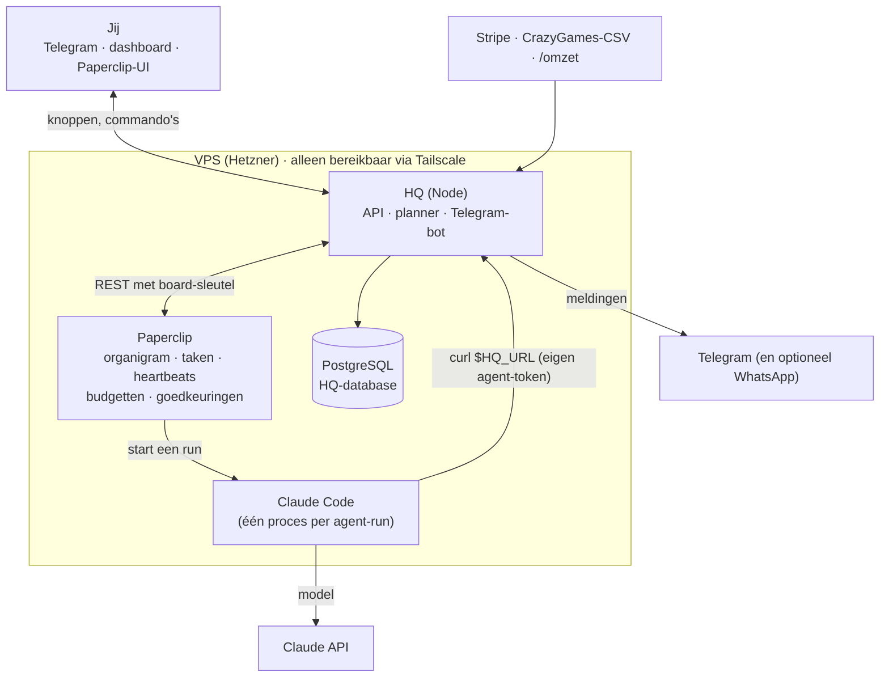
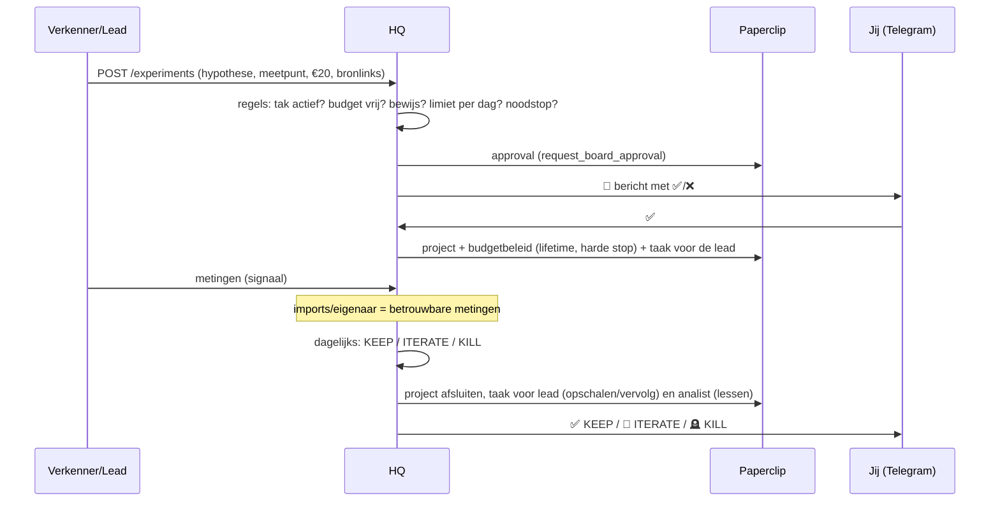

# Architectuur

## In één zin
**Paperclip** regelt de agents; **HQ** regelt geld, experimenten, beslissingen en veiligheid; **jij** beslist
via Telegram. Alles draait op één VPS; niets is open op het internet (Tailscale + firewall).

## Wie doet wat
| Onderdeel | Verantwoordelijk voor | Niet voor |
|---|---|---|
| **Paperclip** | agents (aannemen, pauzeren, heartbeats), taken, routines op schema, kosten per agent/project, **harde budgetstops**, audit-log, web-UI | geld dat binnenkomt, experimentlogica |
| **HQ** | grootboek (omzet, AI-kosten, uitgaven), experimenten en hun beslissingen, portfolio, lessen, goedkeuringen via Telegram, kill switch, dagrapport | agents zelf draaien |
| **Agents** | onderzoek, voorstellen, bouwen, meten, lessen schrijven | geld, accounts, publiceren, omzet boeken |
| **Jij** | ✅/❌ op geld, publicaties, aannames en nieuwe takken; omzet invoeren als die niet automatisch binnenkomt | het dagelijkse werk |

## Levensloop van een experiment

**Beslisregels** (`hq/src/domain/evaluator.ts`, getest):
- **KEEP** zodra een *betrouwbare* meting het doel haalt (mag voor de deadline).
- Loopt nog zolang deadline en budget niet op zijn.
- Daarna **ITERATE** bij signaal (betrouwbaar ≥ 50% van het doel, of een agent-meting ≥ doel) en nog iteraties
  over (max. 2), anders **KILL**.
- Stoppen gebeurt automatisch (bespaart alleen geld). Opschalen vraagt altijd jouw akkoord.

## Goedkeuringen
Alles wat op jou wacht, is een approval in Paperclip. HQ spiegelt ze, zet ze met knoppen in Telegram en voert
het besluit uit. Beslis je in de Paperclip-UI, dan neemt HQ dat binnen twee minuten over.

| Soort | Komt van | Na ✅ |
|---|---|---|
| `experiment_start` | agent via HQ | project met budgetstop + taak voor de lead |
| `budget_increase` | lead na een KEEP | hoger projectbudget, gepauzeerd project hervat |
| `spend` | agent via HQ | geboekt als uitgave; **jij** betaalt, agents kunnen dat niet |
| `branch_create` | CEO via HQ | Agent Factory bouwt de tak (agents, routines, budget) |
| `portfolio` | HQ, elke maandag | nieuwe budgetten per tak + maandplafond in Paperclip |
| `hire_agent` | CEO/lead in Paperclip | Paperclip activeert de agent |
| `ceo_strategy` | CEO in Paperclip | weekplan akkoord |
| `budget_override` | Paperclip bij een budgetstop | ✅ = budget +50% en hervatten, ⏸ = gepauzeerd laten |

## Vier lagen geldbeveiliging
1. **Anthropic Console-limiet** (buiten het systeem): de API-sleutel stopt bij je maandlimiet.
2. **Paperclip, harde stops:** maandplafond voor het hele bedrijf, maandbudget per agent en een levenslang budget
   per experimentproject. Bij overschrijding pauzeert Paperclip het werk zelf.
3. **HQ, poorten vooraf:** max. €50 per experiment, takbudget, totaal plafond (+30% van de omzet), max. 5 verzoeken
   per agent per dag, bewijslinks verplicht.
4. **HQ, noodstop:** `/stop` of automatisch als de AI-kosten van vandaag boven `HQ_DAILY_SPEND_ALARM_EUR` komen.
   Het bedrijf in Paperclip en alle agents gaan op pauze, lopende runs worden afgebroken, en de HQ-API weigert
   agent-acties met `423`.

## Veiligheid
- **Geen open poorten:** de firewall laat alleen SSH en Tailscale toe. Telegram werkt met *long polling* (HQ haalt
  berichten op), dus er is geen webhook nodig.
- **Agents bewijzen wie ze zijn** met hun eigen Paperclip-token; HQ vraagt Paperclip wie erachter zit
  (`/api/agents/me`). Agents van een ander bedrijf of beëindigde agents komen er niet in.
- **Agents kunnen geen omzet boeken:** daar is geen endpoint voor, en de database weigert bron `agent`.
- **Agent-metingen tellen niet als bewijs** (`trusted=false`); alleen imports en jij leveren bewijs.
- **Wat HQ zelf mag zonder jou:** experimenten stoppen, alles pauzeren, en de aannames goedkeuren die horen bij een
  tak die jij net goedkeurde. Verder niets dat geld kost.
- **Geheimen** staan alleen in `~/.config/hq/hq.env` (chmod 600). De board-sleutel is krachtig: deel hem nooit.
- **Prompt-injectie** (een agent leest een kwaadaardige webpagina): HQ's harde regels gelden hoe overtuigend een
  agent ook schrijft: bedragen, limieten, bewijs, rate limits en jouw ✅.

## Datamodel (HQ)
| Tabel | Inhoud |
|---|---|
| `branches` | takken met status, maandbudget en lead-agent (`holding` = overhead) |
| `experiments` | hypothese, meetpunt + doel, budget, deadline, status, voorspelling, Paperclip-project |
| `metrics` | metingen per experiment, met bron en `trusted` |
| `ledger` | alle geldstromen: `revenue`, `token_cost`, `spend`, uniek per bron + extern id (geen dubbeltellingen) |
| `lessons` | lessen met bewijs en tags (full-text doorzoekbaar) |
| `approvals` | spiegel van Paperclip-approvals met soort, bedrag, status en of het besluit is uitgevoerd |
| `settings`, `audit_log`, `job_runs`, `notifications_sent` | noodstop-status, logboek van elke actie, planner-status, meldingen zonder dubbelingen |

## Uitbreiden
- **Nieuwe tak-soort:** een YAML in `company/templates/branches/` (agents + routines). Daarna `hq bootstrap`.
- **Betere prompts:** pas `company/agents/*.md`, `company/templates/agents/*.md` of `company/skills/*.md` aan.
  `update.sh` zet ze door; alleen agents waarvan het sjabloon echt veranderde worden bijgewerkt.
- **Nieuwe omzetbron:** een importer in `hq/src/importers/` en een job in `hq/src/jobs/scheduler.ts`.
  Voeg de bron toe aan `REVENUE_SOURCES` in `hq/src/domain/ledger.ts`.
- **Andere beslisregels:** `decide()` in `hq/src/domain/evaluator.ts` (pure functie, met tests).
